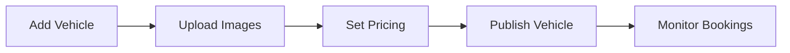
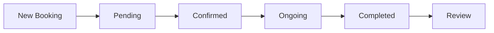

<div align="center">
  
  
  
  
</div>

# Car Rental Management System

> A modern, comprehensive car rental management platform built with Laravel 12 and Filament v4, featuring advanced booking management, fleet control, and customer relationship tools.

## Overview

This enterprise-grade car rental management system provides a complete solution for rental businesses of all sizes. Built with modern web technologies and best practices, it offers intuitive interfaces for both administrators and customers, comprehensive reporting, and seamless integrations.

## Screenshots

### 🎯 Admin Dashboard & Analytics

*Real-time business metrics, revenue tracking, and fleet monitoring with interactive charts*

### 🚗 Fleet Management

*Comprehensive vehicle inventory with advanced filtering, status tracking, and bulk operations*

### 📅 Booking System

*Visual booking management with drag-and-drop functionality and availability timeline*

### 💰 Payment Processing

*Transaction tracking, invoice generation, and multi-gateway payment support*

### 👥 User Management

*Customer profiles, role management, and verification workflows*

### 📱 Mobile Responsive

*Fully responsive design optimized for tablets and mobile devices*

*Note: Screenshots showcase the application with **Malaysian Ringgit (RM)** currency and **bilingual Arabic/English** interface*

## Table of Contents

- [Features](#features)
- [Tech Stack](#tech-stack)
- [Quick Start](#quick-start)
- [Installation](#installation)
- [Configuration](#configuration)
- [Usage](#usage)
- [API Documentation](#api-documentation)
- [Testing](#testing)
- [Deployment](#deployment)
- [Contributing](#contributing)
- [Security](#security)
- [Troubleshooting](#troubleshooting)
- [License](#license)

## Features

### Core Business Functions
- **Fleet Management** - Comprehensive vehicle inventory with detailed specifications, maintenance tracking, and availability management
- **Reservation System** - Advanced booking engine with real-time availability, automated pricing, and status workflows
- **Customer Portal** - User registration, profile management, booking history, and review system
- **Payment Processing** - Multi-gateway payment support with transaction tracking and automated invoicing
- **Reporting & Analytics** - Business intelligence dashboards with revenue tracking and performance metrics

### Administrative Tools
- **Role-Based Access Control** - Granular permissions for admin, manager, and staff roles
- **Activity Monitoring** - Comprehensive audit trails with user action logging
- **Notification System** - Automated alerts for bookings, payments, and system events
- **Data Export** - CSV/PDF export capabilities for reports and customer data
- **System Configuration** - Flexible settings for pricing, policies, and business rules

### User Experience
- **Responsive Design** - Mobile-first interface optimized for all devices
- **Multi-language Support** - Full internationalization with Arabic and English support
- **MYR Currency Integration** - Built-in Malaysian Ringgit (RM) support with flexible currency system
- **Interactive Calendar** - Visual booking management with drag-and-drop functionality
- **Real-time Updates** - Live form calculations and instant status updates
- **Advanced Search** - Powerful filtering and search capabilities across all modules

## Tech Stack

### Backend Framework
| Technology | Version | Purpose |
|------------|---------|---------|
| **Laravel** | 12.x | Core framework with modern PHP features |
| **PHP** | 8.4+ | Server-side scripting with latest performance improvements |
| **MySQL** | 8.0+ | Primary database with full ACID compliance |

### Frontend & UI
| Technology | Version | Purpose |
|------------|---------|---------|
| **Filament** | v4 | Admin panel with Server-Driven UI architecture |
| **Livewire** | v3 | Dynamic frontend without JavaScript complexity |
| **Alpine.js** | v3 | Lightweight JavaScript framework for interactions |
| **Tailwind CSS** | v3 | Utility-first CSS framework for rapid styling |

### Key Packages & Integrations
| Package | Purpose |
|---------|---------|
| `spatie/laravel-activitylog` | Comprehensive audit logging |
| `spatie/laravel-medialibrary` | Advanced media management |
| `malzariey/filament-daterangepicker-filter` | Enhanced date filtering |
| `mokhosh/filament-rating` | Interactive star rating system |
| `guava/calendar` | Full-featured calendar widgets |
| `pestphp/pest` | Modern testing framework |
| `laravel/sanctum` | API authentication |

### Development Tools
- **Laravel Pint** - Code formatting and standards
- **Rector** - Automated code refactoring
- **PHPUnit/Pest** - Comprehensive testing suite
- **Vite** - Modern asset bundling and HMR

## Quick Start

For a rapid setup, ensure you have the prerequisites and run:

```bash
git clone https://github.com/AdilAzhari/Car-Rental-System.git
cd Car-Rental-System
composer install && npm install
cp .env.example .env && php artisan key:generate
php artisan migrate --seed
npm run build && php artisan serve
```

Visit `http://localhost:8000/admin` with credentials: `admin@example.com` / `password`

## Installation

### System Requirements

| Requirement | Minimum Version | Recommended |
|-------------|----------------|-------------|
| **PHP** | 8.4 | 8.4+ |
| **Composer** | 2.0 | Latest |
| **Node.js** | 18.0 | 20+ LTS |
| **MySQL** | 8.0 | 8.0+ |
| **Memory** | 512MB | 1GB+ |
| **Disk Space** | 1GB | 2GB+ |

### Web Server Configuration

<details>
<summary><strong>Apache Configuration</strong></summary>

```apache
<VirtualHost *:80>
    ServerName car-rental.local
    DocumentRoot /path/to/CarRentSystem/public

    <Directory /path/to/CarRentSystem/public>
        AllowOverride All
        Require all granted
    </Directory>

    ErrorLog ${APACHE_LOG_DIR}/car-rental_error.log
    CustomLog ${APACHE_LOG_DIR}/car-rental_access.log combined
</VirtualHost>
```
</details>

<details>
<summary><strong>Nginx Configuration</strong></summary>

```nginx
server {
    listen 80;
    server_name car-rental.local;
    root /path/to/CarRentSystem/public;

    add_header X-Frame-Options "SAMEORIGIN";
    add_header X-Content-Type-Options "nosniff";

    index index.php;

    charset utf-8;

    location / {
        try_files $uri $uri/ /index.php?$query_string;
    }

    location = /favicon.ico { access_log off; log_not_found off; }
    location = /robots.txt  { access_log off; log_not_found off; }

    error_page 404 /index.php;

    location ~ \.php$ {
        fastcgi_pass unix:/var/run/php/php8.4-fpm.sock;
        fastcgi_param SCRIPT_FILENAME $realpath_root$fastcgi_script_name;
        include fastcgi_params;
    }

    location ~ /\.(?!well-known).* {
        deny all;
    }
}
```
</details>

### Installation Steps

#### 1. Repository Setup
```bash
# Clone the repository
git clone https://github.com/AdilAzhari/Car-Rental-System.git
cd Car-Rental-System

# Set proper permissions (Linux/macOS)
chmod -R 755 storage bootstrap/cache
```

#### 2. Dependency Installation
```bash
# Install PHP dependencies
composer install --optimize-autoloader --no-dev

# Install Node.js dependencies
npm ci
```

#### 3. Environment Configuration
```bash
# Create environment file
cp .env.example .env

# Generate application key
php artisan key:generate

# Generate JWT secret (if using API)
php artisan jwt:secret
```

#### 4. Database Configuration
Edit your `.env` file with the following settings:

```env
# Application
APP_NAME="Car Rental System"
APP_ENV=production
APP_DEBUG=false
APP_URL=https://your-domain.com

# Database
DB_CONNECTION=mysql
DB_HOST=127.0.0.1
DB_PORT=3306
DB_DATABASE=car_rental_system
DB_USERNAME=your_database_user
DB_PASSWORD=your_secure_password

# Cache & Session
CACHE_DRIVER=redis
SESSION_DRIVER=redis
QUEUE_CONNECTION=redis

# Mail Configuration
MAIL_MAILER=smtp
MAIL_HOST=your-smtp-host
MAIL_PORT=587
MAIL_USERNAME=your-email@domain.com
MAIL_PASSWORD=your-email-password
MAIL_ENCRYPTION=tls
MAIL_FROM_ADDRESS=noreply@your-domain.com
MAIL_FROM_NAME="${APP_NAME}"

# File Storage
FILESYSTEM_DISK=local
# For production, consider using S3 or similar
# FILESYSTEM_DISK=s3
# AWS_ACCESS_KEY_ID=
# AWS_SECRET_ACCESS_KEY=
# AWS_DEFAULT_REGION=
# AWS_BUCKET=
```

#### 5. Database Setup
```bash
# Run database migrations
php artisan migrate

# Seed with sample data (optional for development)
php artisan db:seed

# Create admin user (production)
php artisan make:filament-user
```

#### 6. Storage & Cache Setup
```bash
# Create storage link
php artisan storage:link

# Optimize for production
php artisan config:cache
php artisan route:cache
php artisan view:cache

# Clear all caches (if needed)
php artisan optimize:clear
```

#### 7. Asset Building
```bash
# Development
npm run dev

# Production
npm run build
```

## Configuration

### Environment Variables

| Variable | Description | Default | Required |
|----------|-------------|---------|----------|
| `APP_NAME` | Application name | Car Rental System | Yes |
| `APP_ENV` | Environment (local/production) | local | Yes |
| `APP_DEBUG` | Debug mode | false | Yes |
| `APP_CURRENCY` | Default currency code | MYR | Yes |
| `APP_CURRENCY_SYMBOL` | Currency symbol | RM | Yes |
| `APP_CURRENCY_POSITION` | Symbol position (before/after) | before | Yes |
| `DB_*` | Database credentials | - | Yes |
| `MAIL_*` | Email configuration | - | Recommended |
| `REDIS_*` | Redis configuration | - | Optional |

### File Permissions

Ensure proper permissions for production:

```bash
# Set ownership (replace user:group)
chown -R www-data:www-data /path/to/CarRentSystem

# Set directory permissions
find /path/to/CarRentSystem -type d -exec chmod 755 {} \;

# Set file permissions
find /path/to/CarRentSystem -type f -exec chmod 644 {} \;

# Make artisan executable
chmod +x /path/to/CarRentSystem/artisan
```

## Usage

### Getting Started

#### Default Credentials
For development and testing purposes:

| Role | Email | Password |
|------|--------|----------|
| **Administrator** | admin@example.com | password |
| **Demo User** | user@example.com | password |

> ⚠️ **Security Notice**: Change default passwords immediately in production environments.

#### First Steps
1. **Login** - Access the admin panel at `/admin`
2. **System Setup** - Configure basic settings under Settings
3. **Add Vehicles** - Start by adding your fleet to the Vehicle Management section
4. **User Management** - Create user accounts or allow registration
5. **Test Booking** - Create a test booking to verify system functionality

### Core Workflows

#### Vehicle Management


1. **Add New Vehicle**
   - Navigate to Vehicles → Create
   - Fill in vehicle specifications (make, model, year, category)
   - Set daily rates and availability
   - Upload high-quality images

2. **Manage Availability**
   - Use the calendar view to see booking schedules
   - Set maintenance periods to block availability
   - Monitor vehicle utilization rates

#### Booking Management


1. **Process New Bookings**
   - Review pending bookings in the dashboard
   - Verify customer information and payment
   - Confirm or reject booking requests

2. **Handle Active Rentals**
   - Track vehicle pickup and return
   - Process payments and deposits
   - Handle any issues or modifications

#### Customer Support
- **User Management** - View customer profiles and booking history
- **Communication** - Use the notification system for updates
- **Issue Resolution** - Track and resolve customer complaints
- **Reviews** - Monitor and respond to customer feedback

### Admin Interface Guide

#### Dashboard Overview
- **Key Metrics** - Revenue, bookings, fleet utilization
- **Recent Activity** - Latest bookings, payments, and user actions
- **Quick Actions** - Fast access to common tasks
- **System Alerts** - Important notifications and warnings

#### Navigation Structure
```
📊 Dashboard
├── 🚗 Vehicles
│   ├── Vehicle List
│   ├── Add Vehicle
│   └── Categories
├── 📅 Bookings
│   ├── All Bookings
│   ├── Calendar View
│   └── Reports
├── 👥 Users
│   ├── Customers
│   ├── Staff
│   └── Roles & Permissions
├── 💰 Payments
│   ├── Transactions
│   ├── Invoices
│   └── Reports
├── ⭐ Reviews
│   ├── All Reviews
│   ├── Moderation
│   └── Featured Reviews
└── ⚙️ Settings
    ├── General
    ├── Pricing
    └── Notifications
```

## API Documentation

The system provides a comprehensive RESTful API for integration with external systems, mobile applications, and third-party services.

### Base URL
```
Production: https://your-domain.com/api/v1
Development: http://localhost:8000/api/v1
```

### Authentication

#### API Token Authentication
```bash
# Get authentication token
curl -X POST "https://your-domain.com/api/v1/auth/login" \
  -H "Content-Type: application/json" \
  -d '{
    "email": "user@example.com",
    "password": "password"
  }'

# Use token in subsequent requests
curl -H "Authorization: Bearer YOUR_TOKEN" \
  "https://your-domain.com/api/v1/vehicles"
```

### Core Endpoints

#### Vehicles
| Method | Endpoint | Description |
|--------|----------|-------------|
| `GET` | `/vehicles` | List all available vehicles |
| `GET` | `/vehicles/{id}` | Get vehicle details |
| `GET` | `/vehicles/search` | Search vehicles with filters |
| `POST` | `/vehicles` | Create new vehicle (admin) |
| `PUT` | `/vehicles/{id}` | Update vehicle (admin) |
| `DELETE` | `/vehicles/{id}` | Delete vehicle (admin) |

<details>
<summary><strong>Example: Get Vehicles</strong></summary>

**Request:**
```bash
GET /api/v1/vehicles?category=suv&available_from=2024-01-01&available_to=2024-01-07
```

**Response:**
```json
{
  "data": [
    {
      "id": 1,
      "make": "Toyota",
      "model": "RAV4",
      "year": 2023,
      "category": "SUV",
      "daily_rate": 89.99,
      "features": ["GPS", "Bluetooth", "Backup Camera"],
      "images": [
        "https://your-domain.com/storage/vehicles/rav4-1.jpg"
      ],
      "availability": {
        "available": true,
        "next_available": null
      }
    }
  ],
  "meta": {
    "current_page": 1,
    "total": 15,
    "per_page": 10
  }
}
```
</details>

#### Bookings
| Method | Endpoint | Description |
|--------|----------|-------------|
| `GET` | `/bookings` | List user bookings |
| `POST` | `/bookings` | Create new booking |
| `GET` | `/bookings/{id}` | Get booking details |
| `PUT` | `/bookings/{id}` | Update booking |
| `DELETE` | `/bookings/{id}` | Cancel booking |

<details>
<summary><strong>Example: Create Booking</strong></summary>

**Request:**
```bash
POST /api/v1/bookings
Content-Type: application/json
Authorization: Bearer YOUR_TOKEN

{
  "vehicle_id": 1,
  "start_date": "2024-01-01",
  "end_date": "2024-01-07",
  "pickup_location": "Main Office",
  "dropoff_location": "Main Office",
  "special_requests": "Child seat needed"
}
```

**Response:**
```json
{
  "data": {
    "id": 123,
    "vehicle": {
      "id": 1,
      "make": "Toyota",
      "model": "RAV4"
    },
    "start_date": "2024-01-01",
    "end_date": "2024-01-07",
    "days": 6,
    "daily_rate": 89.99,
    "total_amount": 539.94,
    "status": "pending",
    "booking_reference": "BR-2024-001234"
  }
}
```
</details>

#### Users & Authentication
| Method | Endpoint | Description |
|--------|----------|-------------|
| `POST` | `/auth/register` | Register new user |
| `POST` | `/auth/login` | User login |
| `POST` | `/auth/logout` | User logout |
| `GET` | `/auth/me` | Get current user |
| `PUT` | `/auth/profile` | Update profile |

### Error Handling

The API uses conventional HTTP response codes and returns errors in a consistent format:

```json
{
  "message": "Validation failed",
  "errors": {
    "email": ["The email field is required."],
    "vehicle_id": ["The selected vehicle is not available."]
  },
  "code": 422
}
```

### Rate Limiting

API requests are limited to:
- **60 requests per minute** for unauthenticated requests
- **120 requests per minute** for authenticated requests
- **300 requests per minute** for admin users

### Webhooks

Configure webhooks to receive real-time notifications:

```json
{
  "event": "booking.created",
  "data": {
    "booking_id": 123,
    "customer_email": "customer@example.com",
    "vehicle": "Toyota RAV4",
    "total_amount": 539.94
  },
  "timestamp": "2024-01-01T12:00:00Z"
}
```

## Testing

### Running Tests

```bash
# Run all tests
php artisan test

# Run specific test suite
php artisan test --testsuite=Feature
php artisan test --testsuite=Unit

# Run with coverage
php artisan test --coverage

# Run specific test file
php artisan test tests/Feature/BookingTest.php

# Run with parallel execution
php artisan test --parallel
```

### Test Categories

#### Unit Tests
- Model relationships and methods
- Service class functionality
- Helper functions and utilities
- Data validation and transformation

#### Feature Tests
- API endpoint functionality
- Authentication and authorization
- Booking workflow processes
- Payment processing
- Email notifications

#### Browser Tests
- Admin interface functionality
- User registration and login
- Booking creation workflow
- Vehicle search and filtering

### Testing Best Practices

```php
// Example test structure
<?php

use App\Models\User;
use App\Models\Vehicle;
use App\Models\Booking;

it('can create a booking with valid data', function () {
    $user = User::factory()->create();
    $vehicle = Vehicle::factory()->available()->create();

    $response = $this->actingAs($user)
        ->postJson('/api/v1/bookings', [
            'vehicle_id' => $vehicle->id,
            'start_date' => now()->addDay()->format('Y-m-d'),
            'end_date' => now()->addDays(3)->format('Y-m-d'),
            'pickup_location' => 'Main Office',
        ]);

    $response->assertStatus(201)
        ->assertJsonStructure([
            'data' => [
                'id',
                'booking_reference',
                'total_amount',
                'status'
            ]
        ]);

    expect(Booking::count())->toBe(1);
});
```

## Deployment

### Production Checklist

Before deploying to production:

- [ ] **Environment Configuration**
  - [ ] Set `APP_ENV=production`
  - [ ] Set `APP_DEBUG=false`
  - [ ] Configure proper database credentials
  - [ ] Set up mail configuration
  - [ ] Configure file storage (S3 recommended)

- [ ] **Security Setup**
  - [ ] Generate new `APP_KEY`
  - [ ] Set up SSL certificate
  - [ ] Configure CORS settings
  - [ ] Set up rate limiting
  - [ ] Configure firewall rules

- [ ] **Performance Optimization**
  - [ ] Enable OPcache
  - [ ] Set up Redis for caching
  - [ ] Configure queue workers
  - [ ] Optimize database queries
  - [ ] Set up CDN for assets

- [ ] **Monitoring & Logging**
  - [ ] Configure error logging
  - [ ] Set up monitoring tools
  - [ ] Configure backup schedules
  - [ ] Set up health checks

### Deployment Strategies

#### Manual Deployment
```bash
# Pull latest changes
git pull origin main

# Install dependencies
composer install --no-dev --optimize-autoloader

# Run migrations
php artisan migrate --force

# Clear and cache configuration
php artisan config:cache
php artisan route:cache
php artisan view:cache

# Build assets
npm run build

# Restart services
sudo systemctl restart php8.4-fpm
sudo systemctl restart nginx
```

#### Zero-Downtime Deployment
Consider using deployment tools like:
- **Laravel Forge** - Automated server management
- **Laravel Vapor** - Serverless deployment on AWS
- **Deployer** - Automated deployment scripts
- **GitHub Actions** - CI/CD pipeline

### Docker Deployment

<details>
<summary><strong>Docker Compose Example</strong></summary>

```yaml
version: '3.8'

services:
  app:
    build: .
    ports:
      - "8000:8000"
    environment:
      - APP_ENV=production
      - APP_DEBUG=false
    volumes:
      - ./storage:/var/www/html/storage
    depends_on:
      - database
      - redis

  database:
    image: mysql:8.0
    environment:
      MYSQL_DATABASE: car_rental_system
      MYSQL_ROOT_PASSWORD: secure_password
    volumes:
      - mysql_data:/var/lib/mysql

  redis:
    image: redis:7-alpine
    command: redis-server --requirepass secure_redis_password

  nginx:
    image: nginx:alpine
    ports:
      - "80:80"
      - "443:443"
    volumes:
      - ./nginx.conf:/etc/nginx/nginx.conf
    depends_on:
      - app

volumes:
  mysql_data:
```
</details>

## Security

### Security Features

#### Authentication & Authorization
- **Multi-factor Authentication** - TOTP support for admin accounts
- **Role-Based Access Control** - Granular permissions for different user types
- **Session Management** - Secure session handling with timeout controls
- **Password Security** - Bcrypt hashing with strength requirements

#### Data Protection
```php
// Input validation example
class CreateBookingRequest extends FormRequest
{
    public function rules(): array
    {
        return [
            'vehicle_id' => 'required|exists:vehicles,id',
            'start_date' => 'required|date|after:today',
            'end_date' => 'required|date|after:start_date',
            'pickup_location' => 'required|string|max:255',
        ];
    }
}
```

#### Security Headers
```php
// config/cors.php
'allowed_headers' => ['*'],
'exposed_headers' => [],
'max_age' => 0,
'supports_credentials' => false,
```

### Security Best Practices

#### Environment Security
```bash
# Production environment variables
APP_ENV=production
APP_DEBUG=false
SESSION_SECURE_COOKIE=true
SESSION_HTTP_ONLY=true
BCRYPT_ROUNDS=12
```

#### Database Security
- **Prepared Statements** - All queries use parameter binding
- **Encryption** - Sensitive data encrypted at rest
- **Backup Encryption** - Database backups are encrypted
- **Access Controls** - Limited database user permissions

#### File Upload Security
```php
// File validation rules
'image' => 'required|image|mimes:jpeg,png,jpg|max:2048',
'document' => 'required|mimes:pdf,doc,docx|max:10240',
```

### Security Monitoring

#### Audit Logging
All critical actions are logged using Spatie Activity Log:
- User authentication attempts
- Admin privilege escalations
- Data modifications
- Payment transactions

#### Failed Login Protection
- **Rate Limiting** - Maximum 5 attempts per minute
- **Account Lockout** - Temporary suspension after repeated failures
- **Notification Alerts** - Admin alerts for suspicious activity

## Troubleshooting

### Common Issues

#### Installation Problems

<details>
<summary><strong>Composer Install Fails</strong></summary>

**Problem:** `composer install` fails with memory errors

**Solution:**
```bash
# Increase PHP memory limit
php -d memory_limit=2G /usr/local/bin/composer install

# Or permanently in php.ini
memory_limit = 2G
```
</details>

<details>
<summary><strong>NPM Install Issues</strong></summary>

**Problem:** Node modules installation fails

**Solutions:**
```bash
# Clear npm cache
npm cache clean --force

# Delete node_modules and reinstall
rm -rf node_modules package-lock.json
npm install

# Use specific Node version
nvm use 20
npm install
```
</details>

<details>
<summary><strong>Permission Errors</strong></summary>

**Problem:** Storage/cache permission denied

**Solution:**
```bash
# Fix Laravel permissions
sudo chown -R www-data:www-data storage bootstrap/cache
sudo chmod -R 775 storage bootstrap/cache

# Or for development
chmod -R 777 storage bootstrap/cache
```
</details>

#### Runtime Errors

<details>
<summary><strong>Database Connection Failed</strong></summary>

**Problem:** `SQLSTATE[HY000] [2002] Connection refused`

**Solutions:**
1. **Check Database Service:**
   ```bash
   sudo systemctl status mysql
   sudo systemctl start mysql
   ```

2. **Verify Credentials:**
   ```bash
   mysql -u username -p -h host database_name
   ```

3. **Check .env Configuration:**
   ```env
   DB_CONNECTION=mysql
   DB_HOST=127.0.0.1
   DB_PORT=3306
   DB_DATABASE=car_rental_system
   ```
</details>

<details>
<summary><strong>Filament Admin Panel 404</strong></summary>

**Problem:** Admin panel returns 404 error

**Solutions:**
1. **Clear Route Cache:**
   ```bash
   php artisan route:clear
   php artisan route:cache
   ```

2. **Check Panel Configuration:**
   ```php
   // config/filament.php
   'path' => 'admin',
   'domain' => null,
   ```

3. **Verify User Permissions:**
   ```bash
   php artisan tinker
   User::where('email', 'admin@example.com')->first()->role;
   ```
</details>

<details>
<summary><strong>Asset Loading Issues</strong></summary>

**Problem:** CSS/JS files not loading or 404 errors

**Solutions:**
```bash
# Rebuild assets
npm run build

# Clear view cache
php artisan view:clear

# Check storage link
php artisan storage:link

# Verify asset URL in .env
APP_URL=http://localhost:8000
```
</details>

#### Performance Issues

<details>
<summary><strong>Slow Database Queries</strong></summary>

**Problem:** Application responds slowly

**Solutions:**
```bash
# Enable query logging
php artisan db:monitor

# Check for N+1 queries
php artisan telescope:install

# Add database indexes
php artisan make:migration add_indexes_to_bookings_table
```

**Example Migration:**
```php
Schema::table('bookings', function (Blueprint $table) {
    $table->index(['vehicle_id', 'start_date', 'end_date']);
    $table->index('status');
    $table->index('created_at');
});
```
</details>

### FAQ

**Q: How do I reset admin password?**
```bash
php artisan tinker
$user = User::where('email', 'admin@example.com')->first();
$user->password = Hash::make('new_password');
$user->save();
```

**Q: How do I enable debug mode safely?**
```bash
# Temporarily enable for specific IP
APP_DEBUG=true
APP_DEBUG_BLACKLIST=192.168.1.100
```

**Q: How do I backup the database?**
```bash
mysqldump -u username -p car_rental_system > backup_$(date +%Y%m%d).sql
```

**Q: How do I migrate to a new server?**
1. Export database and files
2. Set up new environment
3. Import database
4. Update .env configuration
5. Run `php artisan migrate:status`

## Contributing

### Development Workflow

1. **Fork & Clone**
   ```bash
   git clone https://github.com/your-username/Car-Rental-System.git
   cd Car-Rental-System
   git checkout -b feature/your-feature-name
   ```

2. **Set Up Development Environment**
   ```bash
   composer install
   npm install
   cp .env.example .env
   php artisan key:generate
   php artisan migrate --seed
   ```

3. **Code Standards**
   ```bash
   # Before committing
   ./vendor/bin/pint
   php artisan test
   ```

4. **Commit Guidelines**
   ```bash
   # Use conventional commits
   git commit -m "feat: add vehicle availability calendar"
   git commit -m "fix: resolve booking calculation error"
   git commit -m "docs: update API documentation"
   ```

### Pull Request Process

1. **Ensure Tests Pass**
   ```bash
   php artisan test --coverage
   ```

2. **Update Documentation**
   - Update README if adding features
   - Add PHPDoc blocks for new methods
   - Update API documentation

3. **Code Review Checklist**
   - [ ] Tests written and passing
   - [ ] Code follows PSR-12 standards
   - [ ] No security vulnerabilities
   - [ ] Performance considerations addressed
   - [ ] Documentation updated

## License

This project is licensed under the **MIT License** - see the [LICENSE](LICENSE) file for details.

### MIT License Summary
- ✅ Commercial use allowed
- ✅ Modification allowed
- ✅ Distribution allowed
- ✅ Private use allowed
- ❌ No warranty provided
- ❌ No liability assumed

## Support & Community

### Getting Help

- **GitHub Issues** - [Report bugs or request features](https://github.com/AdilAzhari/Car-Rental-System/issues)
- **Discussions** - [Community discussions and Q&A](https://github.com/AdilAzhari/Car-Rental-System/discussions)
- **Documentation** - Comprehensive guides in this README
- **Code Examples** - Check the `/tests` directory for usage examples

### Contributing Back

We welcome contributions! Whether it's:
- 🐛 Bug fixes
- ✨ New features
- 📚 Documentation improvements
- 🧪 Test coverage
- 🌍 Translations

### Acknowledgments

Special thanks to:
- **[Laravel](https://laravel.com)** - The elegant PHP framework
- **[Filament](https://filamentphp.com)** - Beautiful admin panels for Laravel
- **[Spatie](https://spatie.be)** - Amazing Laravel packages
- **[Tailwind CSS](https://tailwindcss.com)** - Utility-first CSS framework
- **[Alpine.js](https://alpinejs.dev)** - Lightweight JavaScript framework

---

<div align="center">
  <p>
    <a href="https://github.com/AdilAzhari/Car-Rental-System">⭐ Star this repo</a> •
    <a href="https://github.com/AdilAzhari/Car-Rental-System/issues">🐛 Report bug</a> •
    <a href="https://github.com/AdilAzhari/Car-Rental-System/discussions">💬 Discuss</a>
  </p>
</div>
